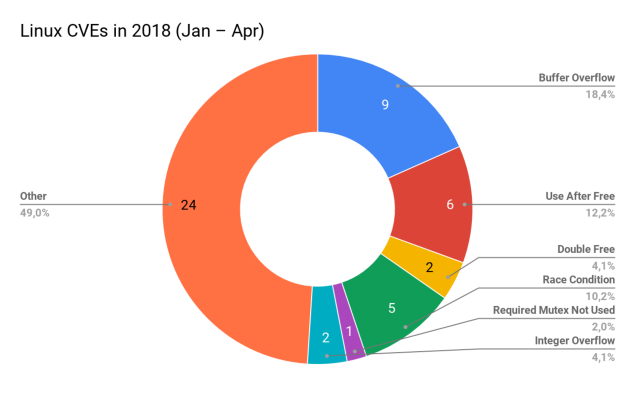

## 为什么使用Rust？

我们都是人，我们的注意力是有限的，我们的记忆是不稳定的--换句话说，我们容易犯错。

计算机和软件无处不在：在太空、地面、海洋、甚至我们的身体中。每天都有越来越多的系统实现自动化，越来越多的人依赖软件(高稳定性、高质量)。

航空电子设备、自动驾驶汽车、核电站、交通控制系统、植入式心脏起搏器等。此类系统中的错误几乎总是危机人类生命。

「通过测试检查程序正确性」和「逻辑证明程序正确性」之间存在着巨大差异。不幸的是，即使我们对代码的每一样都进行了测试，我们仍然无法确定它是否正确。

### Rust优势

「Rust作为一种编程语言」的不同之处，学习Rust不是因为它花哨的语法或热情的社区，而是因为人们在用它便携程序时获的的信心。**Rust非常严格和严谨的编译器检查您使用的每个变量以及您引用的每个内存地址** 。看起来它会影响您编写效率、富有表现力的代码，但令人惊讶的是，恰恰相反：**编写一个有效且惯用的Rust程序实际上比编写潜在漏洞的程序更容易** 。

在后一种情况下，您将与编译器冲突，因为您的每个操作都可能导致内存安全漏洞。

[talk-konstanz-may-2018](https://phil-opp.github.io/talk-konstanz-may-2018/#14)

上图右侧显示了并发性和内存安相关的问题，这些问题根源上不可能发生在常规(非unsafe)Rust代码中。所以，**只需要换成Rust，他们就可以杜绝这段时间内一大半的Bug**，因为它们会导致机密泄漏、拒绝服务和远程代码执行漏洞。

Linux 内核是由业内顶级的 **5%** 中的佼佼者编写的，然而每年仍然可以在CVE(CVE是国际著名的安全漏洞库)中发现50多个安全漏洞。当然，与数百万行代码相比，这 **50** 个错误微不足道。但是，生死问题，还记得吗？ 当我们谈论关键系统时，即使是微小的错误也可能导致灾难性的后果。更不用说这 **50** 个是发现的错误，谁知道还有多少没有被发现的？ **如果使用Rust，我们会在编译发现这些问题** 。

#### 运行速度优势

现在编程语言中的 **内存安全伴随着垃圾回收的成本** ，并发通常通过同步原子性锁定所受影响的数据结构和执行路径进行解决。对于Rust来说，并不会采用运行时GC这种方式保证内存安全，Rust在编译时就解决了这些问题。

在`C++`中，只需要为使用的内存负责。例如，在Rust中，只有在绝对需要时才使用Mutex，而且Rust编译器会强制你使用它，所以你永远不会忘记添加它。而这一切基本上都是零成本的。由于大多数检查是在编译器执行的，因此编译后的程序与`C`或`C++`编译器生成的程序集没有太大区别。正因为如此，**Rust现在在嵌入式电子、物联网，甚至操作系统开发领域都非常有前途** -- 以前由于高控制要求和严格的资源和性能限制，这些领域由`C`主导。

Rust最新版本甚至为用户空间带来了SIMD支持。之前，由于API稳定性限制，它仅在`beta`版本中可用。现在，你可以通过直接使用向量指令或使用方便的lib库来释放硬件的潜力